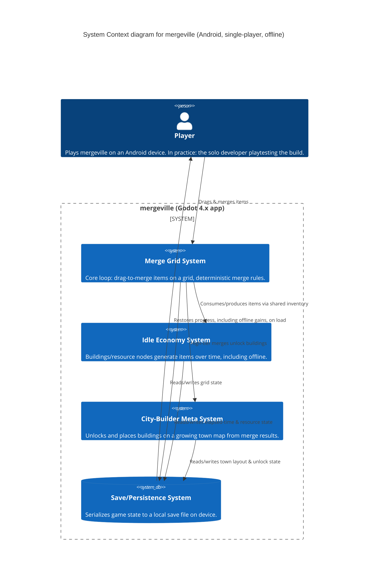

# mergeville — Architecture

## System Diagram



No external systems, backend services, or network calls are involved — see [[ASSUME-002]] (`.memory/assumptions/ASSUME-002-local-only-single-player-no-backend.md`). The entire system runs client-side on the player's Android device.

## Tech Stack

- **Engine / Language:** Godot 4.x, GDScript — see [ADR-0001](decisions/ADR-0001-godot-4-gdscript-engine.md).
- **Target platform:** Android (via Godot's built-in Android export template). No iOS/desktop export planned currently.
- **Persistence:** Local file-based save (Godot's `FileAccess` + a serialized resource or JSON), no database, no backend.
- **Build/deploy:** Manual Godot Editor Android export builds. No CI/CD pipeline at this stage (concept-stage, lightweight testing approach — see `.memory/testing.md`).

## Layers

mergeville is organized as three cooperating gameplay systems sitting on top of a shared persistence layer, rather than a traditional presentation/application/domain/infrastructure split (appropriate for a single-player client-only Godot game):

- **Merge Grid (core loop):** scene(s)/nodes representing the grid, item pieces, and drag-and-drop/merge input handling. Deterministic merge-rule logic (item A + item A → item A+1) lives here, decoupled from rendering where practical so rules can be unit-tested (see `.memory/testing.md`).
- **Idle Economy:** an autoload (singleton) system tracking resource-generating buildings/nodes, their production rates, and elapsed real-world time (including while the app was closed) to compute offline generation on load.
- **City-Builder Meta:** the town map scene, building placement/unlock logic driven by merge-tier milestones from the Merge Grid system.
- **Save/Persistence:** an autoload responsible for serializing/deserializing the combined state (grid, economy, town map) to a local save file, and for timestamping saves to support offline-progress calculation.

## Key Patterns

- **Autoload singletons** for cross-scene systems that need global access without tight coupling: Idle Economy, Save/Persistence, and a shared game-state/inventory resource.
- **Signals (Godot's observer pattern)** to decouple the Merge Grid from the Idle Economy and Town Meta systems — e.g. a `item_merged(tier, position)` signal the Town Meta system listens for, rather than direct method calls between systems.
- **Resource-based data modeling**: Godot `Resource` subclasses (e.g. `ItemDefinition`, `BuildingDefinition`) for deterministic, data-driven merge/building rules — editable as data rather than hardcoded logic, and easy to unit-test.

## Source code layout

Indicative layout (to be created as implementation begins via the `feature`/`implement` skills):

```
mergeville/
├── project.godot
├── scenes/
│   ├── merge_grid/          # Grid scene, item piece scenes, drag/merge input
│   ├── town_map/            # Town map scene, building scenes
│   └── ui/                  # HUD, menus
├── scripts/
│   ├── autoloads/           # idle_economy.gd, save_system.gd, game_state.gd
│   ├── merge_grid/          # grid.gd, item.gd, merge_rules.gd
│   └── town_map/            # town_map.gd, building.gd
├── resources/
│   ├── items/                # ItemDefinition .tres resources per tier
│   └── buildings/            # BuildingDefinition .tres resources
└── tests/                    # GUT (Godot Unit Test) specs — see .memory/testing.md
```

## Data Flow

1. On launch, **Save/Persistence** loads the last saved state (grid contents, town layout, currencies, last-saved timestamp).
2. **Idle Economy** compares the last-saved timestamp to now and grants offline-generated resources before gameplay begins.
3. During play, the **Merge Grid** handles drag input; on a valid merge it updates grid state and emits a signal with the resulting tier.
4. **Idle Economy** and **City-Builder Meta** listen for relevant signals (new resource generated, tier-unlock threshold reached) and update their own state (spawn new resource nodes, unlock a building for placement).
5. **Save/Persistence** periodically (and on app pause/quit) serializes the combined state back to the local save file, refreshing the timestamp used for the next offline-gain calculation.

## Cross-Cutting Concerns

- **Security:** minimal attack surface — no network calls, no backend, no user accounts or PII. Local save-file tampering is a low-stakes concern (no leaderboard/competitive integrity to protect) and is out of scope to defend against at this stage.
- **Observability:** none planned; the developer's own playtesting is the feedback loop (see open question in `.memory/product-vision.md` on whether lightweight telemetry is ever added).
- **Error Handling:** primarily around save/load (corrupt or missing save file should fall back to a fresh game state rather than crashing).
- **Performance:** grid/merge and idle-tick logic should stay lightweight enough for low-to-mid-range Android devices; no specific performance budget defined yet.

## Assumptions

- [[ASSUME-002]] (`.memory/assumptions/ASSUME-002-local-only-single-player-no-backend.md`) — single-player, local-only persistence, no backend/server. This assumption directly shapes the architecture above (no network/API layer, no auth).

## ADRs

| ID | Title | Status | Date |
|----|-------|--------|------|
| [ADR-0001](decisions/ADR-0001-godot-4-gdscript-engine.md) | Use Godot 4.x / GDScript as the game engine | Accepted | 2026-08-09 |
